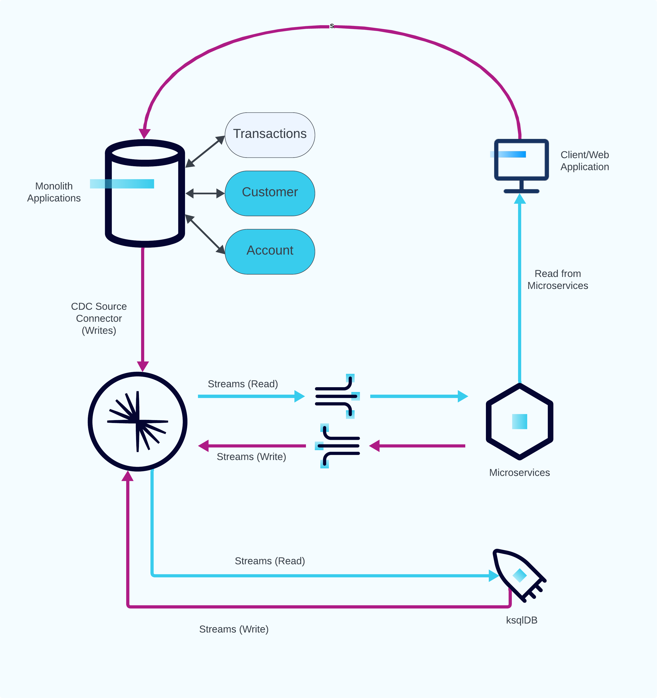
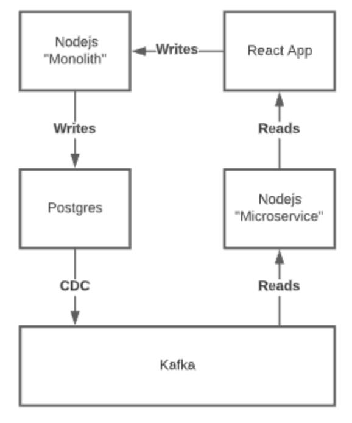

<div align="center" padding=25px>
    
</div>

# <div align="center">Application Modernization with Confluent Cloud</div>

## <div align="center">Workshop & Lab Guide</div>

# Introduction

In this demo, you'll walk through the stages describe in the [Strangler Fig Pattern](https://developer.confluent.io/patterns/compositional-patterns/strangler-fig) for incrementally breaking a monolithic application down into microservices. The intention of this demo is to express the stages involved in this process by providing components that come prebuilt and ready to deploy. Additionally, we'll show how you can build new use cases with Confluent Cloud after setting your data in motion. The below diagram show you the final state as a reference. All that's left is for you to deploy them in the order described in this guide and view the results.

<div align="center">
    
</div>

---

## game-day scenario

Here is the list that become task and challenge to solve by the team.

Rules and scenario:
1. Team will consist of 3-4 people.
2. Each team need to put their team name to be identified in leaderboard
3. Environment will be provided by the Event Organizer (Kubernetes and Confluent Cloud)
4. Creating a access console to source code and ksqlDB

Task:
1. Set something as false property/decoy and fix what needs to be done (zookeeper connection to bootstrap, create API Key and Secret, fill the sasl.jaas.config with the API key, linger.ms and batch.size value)
2. Compression type and value (gzip/lz4/snappy/zstd) choices for the best performance.
3. Create CDC Connector
4. Complete the query on ksqlDB (copy paste the query that already been created with blank on the query to be completed)

Still on-progress:
1. Terraform to build environment
2. Task that need to be completed on Kafka Client
3. Creating automatic Webapp data creation
4. Leaderboard to show whose the King of the game
5. Creating the step-by-step (execution to user as checkpoint) as we've had on AWS Game-day

## Build-up Environment

The following steps will bring you through the process of "Modernizing" the provided application using Confluent Cloud and `Kafka`. Use the following simple diagram to capture the basic flow (not everything is depicted).

<div align="center">
    
</div>

### Deploy the Services (Monolith, Microservices, WebApp)

1. Navigate to repo's directory.
   ```bash
   cd demo-application-modernization
   ```
1. If you haven't already, start `minikube`. If it's already started, you can skip this step.
   ```bash
   # minikube start can take arguments for how much of the host resources you want to dedicate to it as described earlier
   minikube start
   ```
1. Deploy the "monolith".
   - Create the "monolith" deployment.
     ```bash
     kubectl create -f k8s/monolith-deployment.yaml
     ```
   - Create the "monolith" service.
     ```bash
     kubectl create -f k8s/monolith-service.yaml
     ```
     > **Note**: If you aren't using `Kubernetes` open a new `Terminal` window and run `npx nodemon monolith.js`.

1. Back on the `Terminal`, use `kubectl` to create and deploy the "microservice".

   - Create the "microservice" deployment.
     ```bash
     kubectl create -f k8s/microservice-deployment.yaml
     ```
   - Create the "microservice" service.
     ```bash
     kubectl create -f k8s/microservice-service.yaml
     ```

   > **Note**: If you aren't using `Kubernetes` open a new `Terminal` window and run `npx nodemon microservices.js`.

1. Next, deploy the web application.

   - Create the web application deployment.
     ```bash
     kubectl create -f k8s/webapp-deployment-mf2.yaml
     ```
   - Create the web application service.
     ```bash
     kubectl create -f k8s/webapp-service.yaml
     ```
     > **Note**: If you aren't using `Kubernetes` open a new `Terminal` window and navigate to `webapp-mf2` and run `npm start`. Then open a new web browser and go to http://localhost:3000.

1. Now, since `minikube` has deployed Kubernetes on a VM on your machine, you'll need to create a tunnel to make the services accessible on your machine. This command will start running in the foreground, so you may want to leave it on a terminal tab so you can stop the tunnel later.
   ```bash
   minikube tunnel
   ```

Now that you have deployed all the components for your "monolith", you can go to http://localhost:80/ in order to access the web application. Try creating a new transaction or querying for the current balance (after you've created a new transaction ideally).

### Deploy the CDC Connector

1. Update the `connectors/postgres_source.json` file to include the correct credentials.
1. Launch a Postgres source connector to connect your database with Confluent Cloud.
   ```bash
   confluent connect cluster create --config-file connectors/postgres_source.json
   ```
   > **Note**: You can deploy this connector through Confluent Cloud web UI as well.
1. Wait until Postgres connector is in `Running` state.
1. Verify `postgres.bank.accounts` and `postgres.bank.customers` topics are populated either through `CLI` or Confluent Cloud web UI.

### Insert transactions

1. Navigate to http://localhost:80/ and insert the following transactions
   - card number: 5208-0272-3184-5035 amount: 5
   - card number: 5188-6083-8011-0307 amount: 100
   - card number: 5188-6083-8011-0307 amount: 250
   - card number: 5188-6083-8011-0307 amount: 400
   - card number: 5588-6461-5550-9705 amount: 120

### Create ksqlDB queries

The "microservice" in this demo will consume messages from `Kafka` by querying a `ksqlDB` table. In order to do that, you'll need to create them first.

1. Navigate to Confluent Cloud web UI and then go to ksqlDB cluster.
1. Change `auto.offset.reset = earliest`.
1. Use the editor to execute the following queries.
1. Create a new stream by reading the messages from the topic `postgres.bank.transactions`.
   ```sql
   CREATE STREAM postgres_transactions WITH (KAFKA_TOPIC='postgres.transactions', KEY_FORMAT ='JSON', VALUE_FORMAT='AVRO');
   ```
1. Verify `postgres_bank_transactions` stream is populated correctly and then hit **Stop**.
   ```sql
   SELECT * FROM postgres_transactions EMIT CHANGES;
   ```
1. Create a new table for the balances of each card by reading from `postgres_bank_transactions` stream you just created.
   ```sql
   CREATE TABLE balances WITH (kafka_topic='balances') AS
       SELECT card_number, SUM(transaction_amount) AS balance
       FROM postgres_transactions
       GROUP BY card_number
   EMIT CHANGES;
   ```
1. Verify the `balances` table is populated correctly.
   ```sql
   SELECT * FROM balances;
   ```
### Add ksqlDB format conversion

Since the data from our nodejs "microservice" won't have a schema (the `node-rdkafka` library doesn't currently have a support for this, but there are some out there), you'll want to convert the messages that will be produced to `Kafka` from the "microservice" to a new topic where the messages will have a given schema. This is pretty simple to do with `ksqlDB`.

1. Create a new stream for the transactions received from the "microservice".

   ```sql
   CREATE STREAM express_transactions (
    `key` VARCHAR KEY,
    `transaction_id` VARCHAR,
    `card_number` VARCHAR,
    `transaction_amount` INTEGER,
    `transaction_time` VARCHAR)
    WITH (kafka_topic='express.transactions', value_format='JSON');
   ```

1. Verify the `express_transactions` stream is populated correctly and then hit **Stop**.
   ```sql
   SELECT * FROM express_transactions EMIT CHANGES;
   ```
1. Create another stream by reading from `express_transactions` and specifying the output stream's value format.
   ```sql
   CREATE STREAM jdbc_transactions WITH (KAFKA_TOPIC='jdbc.transactions', PARTITIONS=6, REPLICAS=3, VALUE_FORMAT='AVRO') AS
      SELECT `key`, `transaction_id`,`card_number`, `transaction_amount`, `transaction_time`
      FROM express_transactions
   EMIT CHANGES;
   ```
1. Verify the `jdbc_transactions` stream is populated correctly and then hit **Stop**.
   ```sql
   SELECT * FROM jdbc_transactions EMIT CHANGES;
   ```
